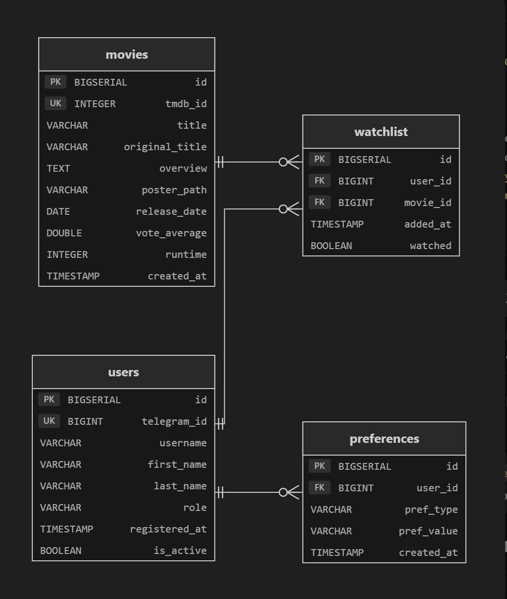
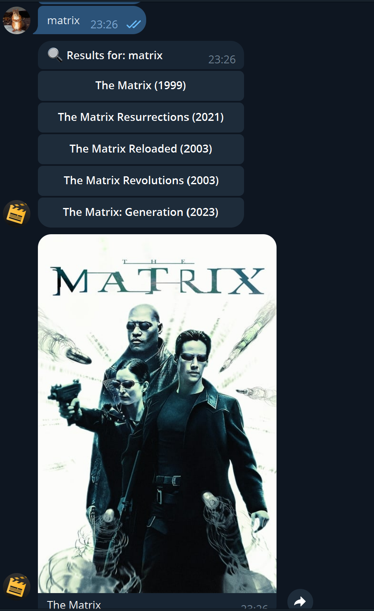
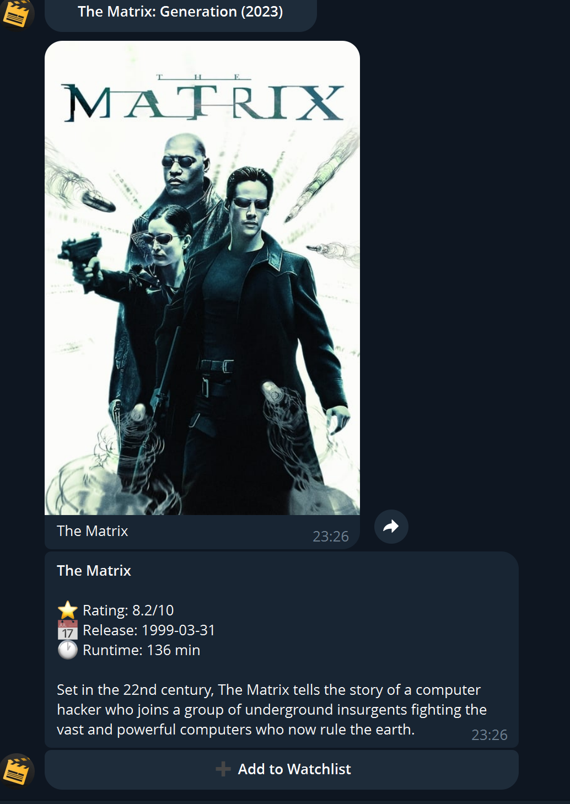
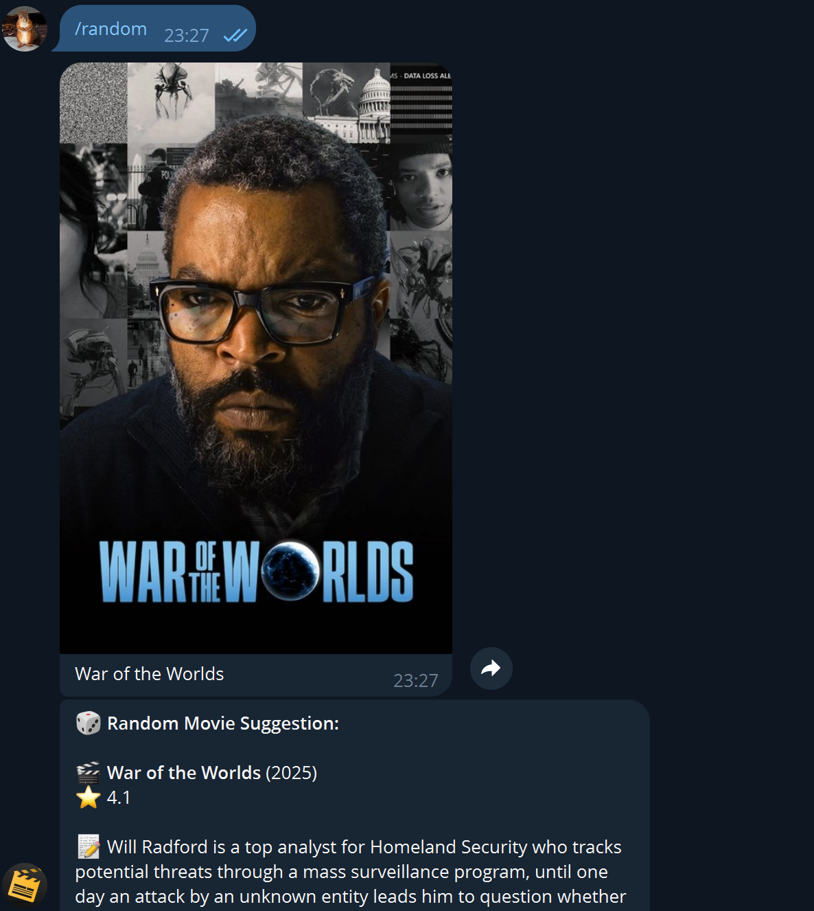
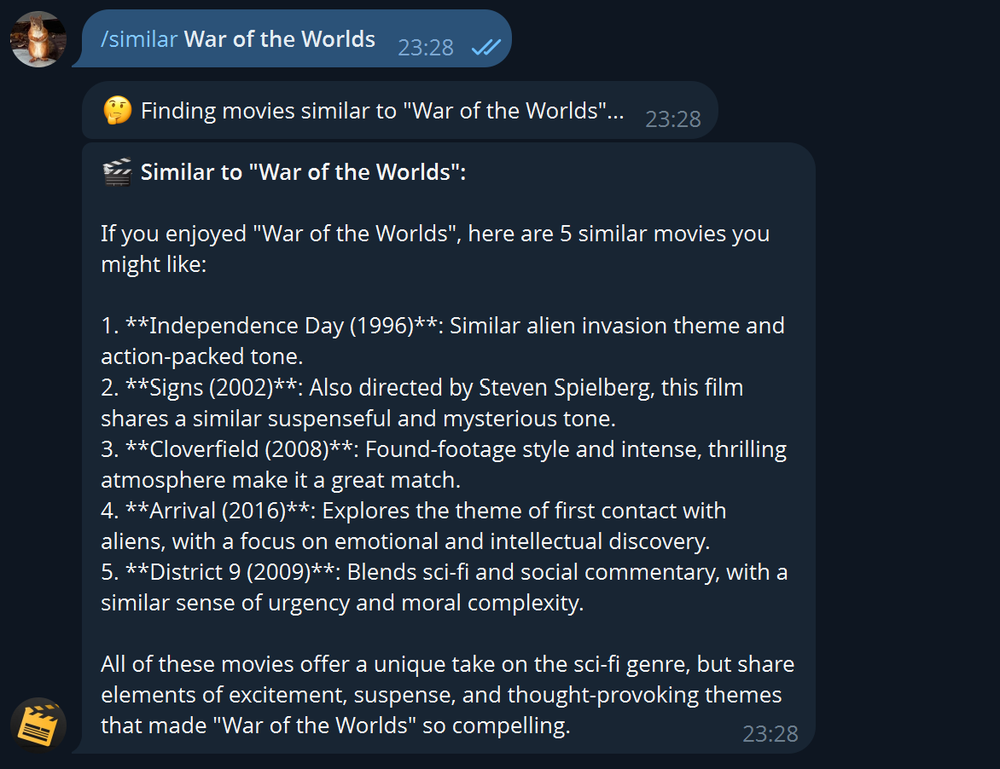
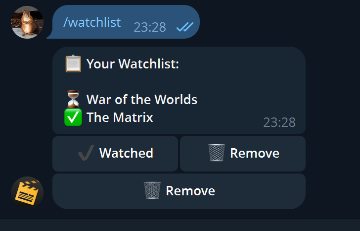
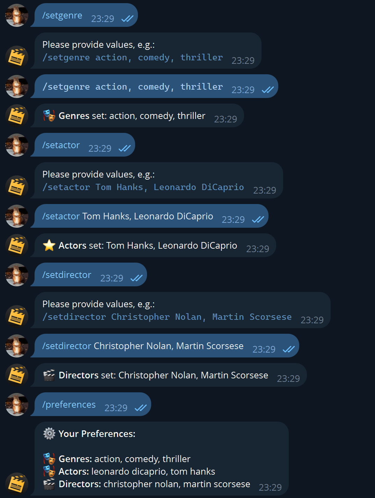
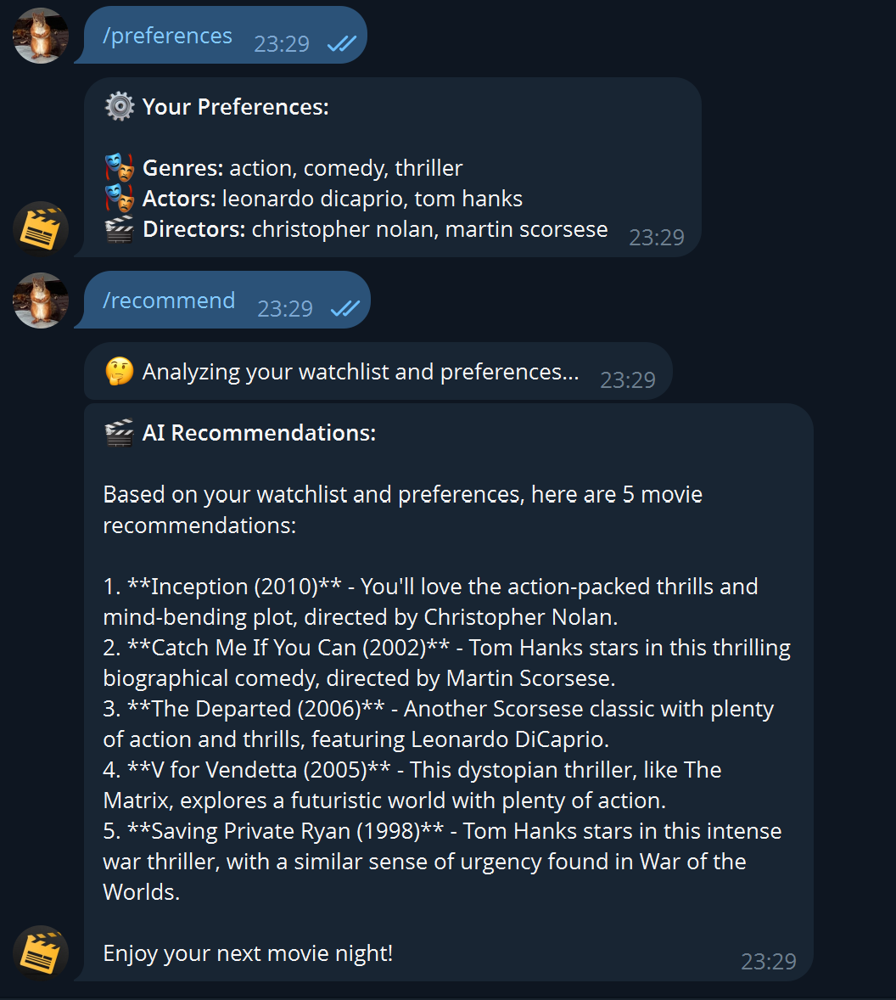
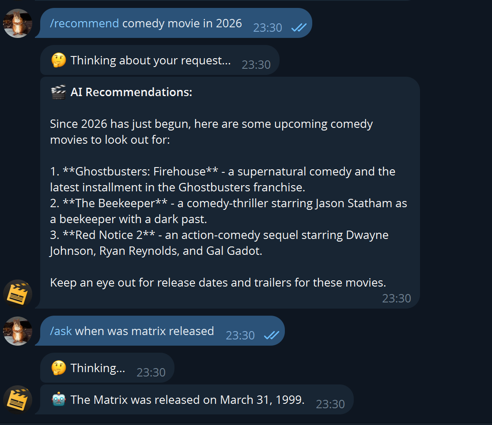

# Movie Tracker and Advisor Bot

Реактивный Telegram-бот для поиска фильмов, управления списком просмотра, настройки предпочтений и получения персонализированных AI-рекомендаций.

Построен на **Spring Framework 7** (без Spring Boot), **jOOQ**, **R2DBC**, **Groq LLM API** и **TMDb API**.


>
> **Docker Hub:** [medsalemab/movie-tracker-spring7](https://hub.docker.com/r/medsalemab/movie-tracker-spring7)

---

## Содержание

- [Стек технологий](#стек-технологий)
- [Архитектура](#архитектура)
- [Схема базы данных](#схема-базы-данных)
- [Структура проекта](#структура-проекта)
- [Требования для запуска](#требования-для-запуска)
- [Настройка и конфигурация](#настройка-и-конфигурация)
- [Сборка и запуск](#сборка-и-запуск)
- [Развертывание в Docker](#развертывание-в-docker)
- [HTTP-эндпоинты](#http-эндпоинты)
- [Команды Telegram-бота](#команды-telegram-бота)
- [Функциональность бота](#функциональность-бота)
- [Покрытие требований](#покрытие-требований)
- [Авторизация](#авторизация)
- [Авторы](#авторы)

---

## Стек технологий

| Компонент         | Технология                                           |
|-------------------|------------------------------------------------------|
| Язык              | Java 25                                              |
| Фреймворк         | Spring 7 (WebFlux, Security) -- **без Spring Boot**  |
| База данных       | PostgreSQL 18 + jOOQ (R2DBC, реактивный доступ)      |
| Очередь сообщений | RabbitMQ (прямой AMQP-клиент)                        |
| LLM API           | Groq (LLaMA) через HTTP                              |
| API фильмов       | TMDb (The Movie Database)                            |
| HTTP-сервер       | Reactor Netty (ручной bootstrap)                     |
| Сборка            | Gradle 9                                             |
| Контейнеризация   | Docker + Docker Compose                              |
| Документация API  | Spring REST Docs                                     |


---

## Архитектура

Система построена на модульной реактивной архитектуре. Весь ввод-вывод неблокирующий через Project Reactor.


Основные модули:

| Модуль                     | Назначение                                                          |
|----------------------------|---------------------------------------------------------------------|
| **Telegram Bot (API)**     | Получает сообщения пользователей через long-polling, маршрутизирует команды |
| **MovieSearchModule**      | Поиск фильмов по названию через TMDb API                           |
| **WatchlistModule**        | Управление списком просмотра (добавление, удаление, отметка просмотренных) через jOOQ |
| **PreferencesModule**      | Хранение и получение предпочтений пользователя (жанры, актеры, режиссеры) |
| **RecommendationModule**   | Генерация AI-рекомендаций через Groq LLM API                       |
| **UserAuthModule**         | Регистрация пользователей, назначение ролей, аутентификация через Telegram ID |
| **HealthCheckModule**      | Публичный эндпоинт `/healthcheck` со статусом сервера и списком авторов |
| **UserListModule**         | Эндпоинт для администраторов -- список всех зарегистрированных пользователей |
| **RecommendationConsumer** | Потребление задач рекомендаций из RabbitMQ                          |
| **External API (HTTP)**    | Исходящие HTTP-запросы к TMDb и Groq LLM                            |
| **API (jOOQ)**             | Реактивный слой доступа к данным (R2DBC + jOOQ) в PostgreSQL        |
| **API (AMQP)**             | Публикация и потребление сообщений RabbitMQ                         |

---

## Схема базы данных



База данных содержит три основные таблицы:
- **users** -- зарегистрированные пользователи (Telegram ID, имя, роль)
- **movies** -- кэш данных о фильмах (TMDb ID, название, рейтинг, постер, жанр)
- **watchlist** -- связь пользователей с фильмами (статус просмотра, дата добавления; уникальный индекс по user_id + movie_id)
- **preference** -- предпочтения пользователя

---

## Структура проекта

```
movie_tracker_spring7/
    docker-compose.yml          -- Docker Compose (приложение + PostgreSQL + RabbitMQ)
    Dockerfile                  -- Многоэтапная сборка Docker (Gradle -> fat JAR)
    build.gradle                -- Конфигурация Gradle 9, зависимости, задача fatJar
    settings.gradle             -- Название проекта
    .env.example                -- Шаблон переменных окружения
    architecture.drawio         -- Редактируемая диаграмма архитектуры (draw.io)
    architecture.png            -- Экспортированная диаграмма архитектуры
    db_schema.png               -- Схема базы данных
    SPRING.md                   -- Спецификация требований курсовой работы

src/main/java/com/movietracker/
    Application.java              -- Ручной bootstrap (AnnotationConfigApplicationContext + Netty)
    bot/
        BotPollingService.java         -- Цикл long-polling Telegram
        CommandRouter.java             -- Диспетчеризация команд и обработчики
        TelegramBotClient.java         -- HTTP-клиент Telegram Bot API
        TelegramUpdateHandler.java     -- Обработка входящих Telegram-обновлений
    config/
        AppConfig.java                 -- Главная конфигурация Spring (@Configuration)
        DatabaseConfig.java            -- Конфигурация R2DBC + jOOQ
        SecurityConfig.java            -- Spring Security (роли, аутентификация)
    controller/
        HealthcheckController.java     -- GET /healthcheck (публичный)
        AdminController.java           -- GET /admin/users (только для администраторов)
    db/                                -- Определения таблиц jOOQ
    model/
        AppUser.java                   -- Доменная сущность пользователя
        Role.java                      -- Перечисление ролей (USER, ADMIN)
    repository/                        -- Реактивный слой доступа к данным
    security/                          -- Менеджер аутентификации, валидация токенов
    service/
        MovieService.java              -- Интеграция с TMDb (поиск, discover, random, детали)
        LlmService.java                -- Интеграция с Groq LLM (рекомендации, Q&A, похожие)
        PreferencesService.java        -- Управление предпочтениями пользователя
        UserService.java               -- Регистрация и поиск пользователей
```

---

## Настройка и конфигурация

1. **Клонировать репозиторий:**
   ```bash
   git clone https://github.com/spbstu-movie-tracker-bot/Movie_tracker.git
   cd Movie_tracker
   ```

2. **Создать файл `.env`** из шаблона:
   ```bash
   cp .env.example .env
   ```

3. **Заполнить переменные окружения** в `.env`:

   | Переменная           | Обязательная | Описание                                         |
   |----------------------|--------------|--------------------------------------------------|
   | `TELEGRAM_BOT_TOKEN` | Да           | Токен Telegram Bot API от @BotFather             |
   | `TMDB_API_KEY`       | Да           | Токен TMDb API для чтения данных                 |
   | `LLM_API_KEY`        | Да           | API-ключ Groq (бесплатно на console.groq.com)    |
   | `PORT`               | Нет          | Порт HTTP-сервера (по умолчанию: `8080`)         |
   | `DB_HOST`            | Нет          | Хост PostgreSQL (по умолчанию: `localhost`)       |
   | `DB_PORT`            | Нет          | Порт PostgreSQL (по умолчанию: `5432`)           |
   | `DB_NAME`            | Нет          | Имя базы данных (по умолчанию: `movietracker`)   |
   | `DB_USER`            | Нет          | Пользователь БД (по умолчанию: `movietracker`)   |
   | `DB_PASSWORD`        | Нет          | Пароль БД                                        |
   | `RABBITMQ_HOST`      | Нет          | Хост RabbitMQ (по умолчанию: `localhost`)        |

---

## Сборка и запуск

### Сборка проекта
```bash
./gradlew build
```

### Локальный запуск (требуется запущенные PostgreSQL и RabbitMQ)
```bash
./gradlew run
```

### Сборка fat JAR
```bash
./gradlew fatJar
java -jar build/libs/movie-tracker-spring7-1.0.0-all.jar
```

---

## Развертывание в Docker

Проект содержит `docker-compose.yml`, который запускает все три сервиса (приложение, PostgreSQL, RabbitMQ) одной командой.

### Запуск всех сервисов
```bash
docker compose up --build
```

Эта команда выполнит:
- Сборку приложения через многоэтапный Dockerfile (Gradle 9 + JDK 25 -> fat JAR -> JRE 25)
- Запуск **PostgreSQL 18** с автоматической инициализацией схемы
- Запуск **RabbitMQ 4** с плагином управления (веб-интерфейс на `http://localhost:15672`)
- Запуск **приложения Movie Tracker** на порту `8081`

### Сборка Docker-образа отдельно
```bash
docker build -t movie-tracker-spring7 .
```

### Публикация в Docker Hub
```bash
docker tag movie-tracker-spring7 medsalemab/movie-tracker-spring7:latest
docker push medsalemab/movie-tracker-spring7:latest
```

---

## Развертывание на AWS

Проект развернут на сервере **AWS EC2** и автоматически обновляется при каждом пуше в ветку `main`.

### Информация о сервере

| Параметр               | Значение                                      |
|------------------------|-----------------------------------------------|
| Облако                 | AWS EC2 (us-east-1)                           |
| Тип инстанса           | t3.small (2 vCPU, 2 GB RAM)                  |
| ОС                     | Ubuntu Server 26.04 LTS                       |

### CI/CD Pipeline

Развертывание полностью автоматизировано через **GitHub Actions** (`.github/workflows/deploy.yml`):

1. При пуше в ветку `main` запускается workflow
2. Исходный код копируется на сервер через SCP
3. На сервере выполняется `docker compose up --build -d`
4. Все три контейнера (PostgreSQL, RabbitMQ, приложение) пересобираются и запускаются

Секреты GitHub (`Settings > Secrets > Actions`):
- `AWS_HOST` -- IP-адрес сервера EC2
- `AWS_PRIVATE_KEY` -- приватный SSH-ключ для подключения к серверу

### Ручное развертывание изменений

Для отправки изменений на сервер достаточно выполнить:

```bash
git add -A
git commit -m "описание изменений"
git push origin main
```

После `git push` GitHub Actions автоматически развернет обновленную версию на AWS сервере. Прогресс можно отслеживать на странице [Actions](https://github.com/spbstu-movie-tracker-bot/Movie_tracker/actions).

---

## HTTP-эндпоинты

| Метод  | Эндпоинт          | Авторизация       | Описание                              |
|--------|--------------------|--------------------|---------------------------------------|
| `GET`  | `/healthcheck`     | Публичный          | Статус сервера + список авторов       |
| `GET`  | `/admin/users`     | Только администратор | Список всех зарегистрированных пользователей |

---

## Команды Telegram-бота


### Поиск фильмов

| Команда / ввод                     | Описание                                                  |
|------------------------------------|-----------------------------------------------------------|
| *(просто введите название фильма)* | Поиск на естественном языке -- префикс команды не нужен   |
| `/search [запрос]`                 | Поиск фильма по названию                                  |
| `/random`                          | Получить случайный фильм (учитывает предпочтения жанров)  |
| `/similar [название]`              | Найти похожие фильмы с помощью AI                         |

### Список просмотра

| Команда       | Описание                                    |
|---------------|---------------------------------------------|
| `/watchlist`  | Показать список просмотра с кнопками действий |

### Предпочтения

| Команда                                  | Описание                                        |
|------------------------------------------|-------------------------------------------------|
| `/setgenre [жанры]`                      | Установить любимые жанры (через запятую)         |
| `/setactor [актеры]`                     | Установить любимых актеров (через запятую)       |
| `/setdirector [режиссеры]`               | Установить любимых режиссеров (через запятую)    |
| `/preferences` или `/prefs`              | Показать текущие предпочтения                    |
| `/clearprefs`                            | Очистить все предпочтения                        |
| `/clearprefs [genre\|actor\|director]`   | Очистить конкретный тип предпочтений             |

### AI-функции

| Команда               | Описание                                                        |
|-----------------------|-----------------------------------------------------------------|
| `/recommend`          | AI-рекомендации на основе списка просмотра и предпочтений       |
| `/recommend [текст]`  | AI-рекомендации по произвольному описанию                       |
| `/ask [вопрос]`       | Задать любой вопрос о фильмах (свободная форма, AI)             |
| `/similar [название]` | Найти похожие фильмы по названию с помощью AI                   |

### Прочее

| Команда   | Описание                 |
|-----------|--------------------------|
| `/start`  | Приветственное сообщение |
| `/help`   | Список всех команд       |

---

## Функциональность бота

### Поиск фильмов

Пользователь может искать фильмы, просто отправив название в чат без какой-либо команды. Бот возвращает список результатов в виде интерактивных кнопок. При нажатии на фильм открывается детальная карточка с постером, рейтингом, датой выхода, продолжительностью и описанием.





---

### Случайный фильм

Команда `/random` предлагает случайный фильм с постером и подробной информацией. Если у пользователя установлены предпочтения по жанрам, случайный фильм выбирается из предпочитаемых жанров. Доступны кнопки "Details", "Add to watchlist" и "Another random".



---

### Поиск похожих фильмов (AI)

Команда `/similar [название]` использует LLM для поиска фильмов, похожих на указанный. AI анализирует тематику, жанр и настроение фильма и предлагает 5 похожих картин с объяснением, почему они подходят.



---

### Список просмотра

Команда `/watchlist` отображает все фильмы в списке просмотра пользователя. Каждый фильм имеет статус (ожидает / просмотрен) и интерактивные кнопки: "Watched" для отметки просмотренного и "Remove" для удаления из списка.



---

### Настройка предпочтений

Пользователь может настроить предпочтения по жанрам (`/setgenre`), актерам (`/setactor`) и режиссерам (`/setdirector`). Значения вводятся через запятую. Команда `/preferences` показывает все текущие настройки. Предпочтения используются для персонализации AI-рекомендаций и случайного выбора фильмов.



---

### AI-рекомендации

Команда `/recommend` без аргументов анализирует список просмотра и предпочтения пользователя, после чего LLM генерирует персонализированные рекомендации. Команда `/recommend [описание]` позволяет получить рекомендации по произвольному описанию (например, "comedy movie in 2026").



---

### Свободные вопросы и рекомендации по описанию

Команда `/ask [вопрос]` позволяет задать любой вопрос о фильмах в свободной форме. Команда `/recommend [текст]` генерирует рекомендации по описанию желаемого фильма.



---

## Покрытие требований


### 5.1. Предпочтения (Preferences)
- Установка любимых жанров, актеров и режиссеров (`/setgenre`, `/setactor`, `/setdirector`)
- Просмотр текущих предпочтений (`/preferences`)
- Удаление предпочтений (`/clearprefs`, `/clearprefs [тип]`)

### 5.2. Список просмотра (Watchlist)
- Добавление фильмов в список просмотра (через результаты поиска -> кнопка "Add to Watchlist")
- Просмотр списка (`/watchlist`)
- Отметка фильмов как просмотренных (inline-кнопка "Watched")
- Удаление фильмов из списка (inline-кнопка "Remove")

### 5.3. Поиск фильмов (Film Search)
- Поиск фильма по запросу -- достаточно ввести название без команды
- Использование предпочтений при отсутствии критериев (discover по жанрам)
- Случайный фильм (`/random` -- учитывает предпочтения жанров)

### 5.4. LLM-советник (LLM Advisor)
- Персонализированные рекомендации на основе предпочтений и списка просмотра (`/recommend`)
- Поиск похожих фильмов по названию через LLM (`/similar [название]`)
- Свободные вопросы о фильмах (`/ask [вопрос]`)

### Общие требования (Common Requirements)
- Авторизация через Telegram (автоматическая регистрация при первом `/start`)
- Авторизация через HTTP (`Authorization: Bearer <telegramId>:<hash>`)
- Роли: `USER` (по умолчанию), `ADMIN`
- Эндпоинт healthcheck (`GET /healthcheck` -- статус сервера + список авторов, без авторизации)
- Эндпоинт пользователей (`GET /admin/users` -- только для роли ADMIN)
- Spring 7 (без Spring Boot) с ручным bootstrap
- Fat JAR как основной артефакт
- Docker + Docker Compose развертывание
- Gradle как инструмент сборки
- Java 25

---

## Авторизация

| Метод        | Механизм                                              |
|--------------|-------------------------------------------------------|
| Telegram     | Заголовок `X-Telegram-User-Id` (автоматически при использовании бота) |
| HTTP         | `Authorization: Bearer <telegramId>:<hash>`           |

Роли:
- `USER` -- роль по умолчанию, назначается при первом взаимодействии
- `ADMIN` -- повышенная роль для доступа к эндпоинтам `/admin/*`

---

## Авторы

- Аббад Мохамед Салем
- Алехин Михаил Игоревич
- Козловская Ольга Алексеевна .
