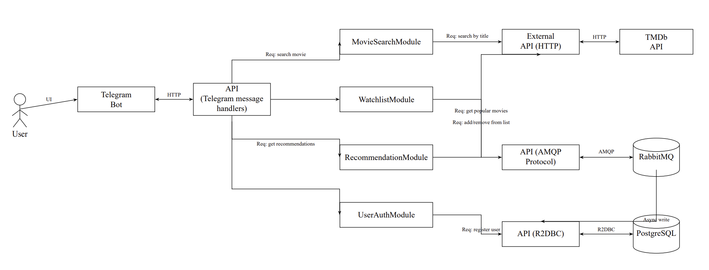

# Архитектурный дизайн — Movie Tracker and Advisor Bot

## 1. Технологический стек

* **Язык программирования**: Java 21.
* **Фреймворк**: Spring Boot 3.x (WebFlux, Data R2DBC, Security).
* **Telegram API**: java-telegram-bot-api (TelegramBots).
* **Преобразование HTTP-запросов (Request Mapping)**: Jackson 2.17.
* **Брокер сообщений**: RabbitMQ 3.13.
* **База данных**: PostgreSQL 16.
* **Контейнеризация**: Docker 27, Docker Compose 2.x.
* **Логирование**: SLF4J 2.0 + Logback.
* **Тестирование**: JUnit 5, Mockito, Testcontainers.
* **Документирование API**: Spring Rest Docs.
* **Сборка**: Gradle.

## 2. Компонентная диаграмма

### 2.1. Telegram-бот
Роль: Пользовательский интерфейс.
Функционал:
* Принимает команды и запросы от пользователей через Telegram.
* Передает запросы на сервер для обработки.
* Отображает пользователю результаты выполнения запросов (текст, постеры, Inline-кнопки).
* Обрабатывает callback-запросы от Inline-кнопок.

### 2.2. Пользователь (User)
Роль: Конечный потребитель сервиса.
Функционал:
* Взаимодействует с системой через Telegram-бота.
* Вызывает команды бота (`/start`, `/help`, `/watchlist`, `/recommend`).
* Осуществляет поиск фильмов путём ввода текстовых запросов.
* Управляет персональным списком отслеживания (добавление, удаление фильмов).

### 2.3. Маршрутизатор команд (CommandRouter Module)
Роль: Маршрутизация и диспетчеризация команд.
Функционал:
* Принимает входящие обновления (updates) от Telegram-бота.
* Определяет тип сообщения (команда, текстовый запрос, медиафайл).
* Маршрутизирует запросы к соответствующим сервисным модулям.
* Обрабатывает некорректный ввод и возвращает пользователю сообщения об ошибках.

### 2.4. Модуль поиска фильмов (MovieSearch Module)
Роль: Поиск информации о фильмах.
Функционал:
* Принимает текстовый запрос пользователя.
* Выполняет HTTP-запрос к TMDb API для поиска фильмов по названию.
* Обрабатывает и форматирует полученные результаты (название, постер, рейтинг, описание).
* Возвращает отсортированный по популярности список фильмов.
* Предоставляет детальную информацию о выбранном фильме.
* Обрабатывает ситуацию, когда результаты не найдены или API недоступен.

### 2.5. Модуль управления списком отслеживания (Watchlist Module)
Роль: Управление персональным списком фильмов пользователя.
Функционал:
* Добавление фильма в список отслеживания пользователя.
* Получение полного списка фильмов пользователя.
* Удаление фильма из списка отслеживания.
* Проверка наличия фильма в списке (для предотвращения дублирования).
* Взаимодействие с базой данных PostgreSQL через R2DBC.

### 2.6. Модуль рекомендаций (Recommendation Module)
Роль: Формирование рекомендаций фильмов.
Функционал:
* Принимает параметры фильтрации (жанр, год выпуска).
* Выполняет HTTP-запрос к TMDb API для получения популярных фильмов с учётом фильтров.
* Возвращает отсортированный по популярности список рекомендованных фильмов.
* При отсутствии параметров возвращает общий список популярных фильмов.

### 2.7. Модуль авторизации (UserAuth Module)
Роль: Управление пользователями.
Функционал:
* Обрабатывает автоматическую регистрацию новых пользователей при первом запуске бота.
* Сохраняет данные пользователей (уникальный идентификатор, дата регистрации) в PostgreSQL.
* Проверяет существование пользователя при каждом обращении.

### 2.8. Брокер сообщений (RabbitMQ)
Роль: Асинхронная обработка задач и обмен сообщениями.
Функционал:
* Обеспечивает асинхронную обработку операций записи в базу данных.
* Гарантирует надёжную доставку сообщений между компонентами системы.
* Обеспечивает буферизацию запросов при пиковых нагрузках.

### 2.9. База данных (PostgreSQL)
Роль: Хранение данных пользователей и списков фильмов.
Функционал:
* Хранение профилей пользователей.
* Хранение списков отслеживания пользователей.
* Хранение метаданных фильмов, добавленных в списки.

### 2.10. Внешний API — TMDb
Роль: Внешний источник данных о фильмах.
Функционал:
* Предоставление данных о фильмах: название, описание, постер, рейтинг, жанры, дата выхода.
* Поиск фильмов по названию.
* Фильтрация фильмов по жанру и году выпуска.
* Получение списка популярных фильмов.
* Ограничение: 40 запросов в 10 секунд (rate limit).
